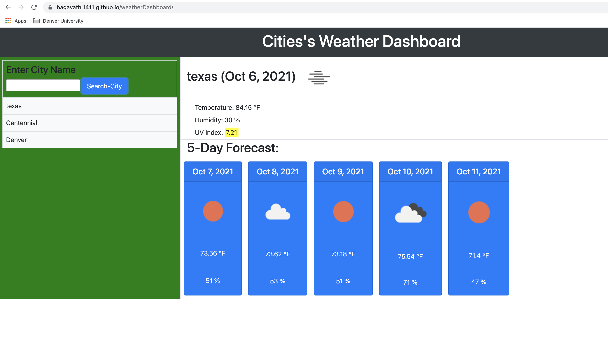

# Project Name:

<h1> Weather Dashboard Using OpenWeather One Call API </h1>

## Project Description:

Using the [OpenWeather One Call API](https://openweathermap.org/api/one-call-api) to retrieve weather data for cities. And store the localStorage to store any persistent data.

Used [Moment.js](https://momentjs.com/) library to work with date and time.

# Tools and Technology Needed:

- Markup launguage (Reference) - HTML https://developer.mozilla.org/en-US/docs/Web/HTML
- Styling CSS https://developer.mozilla.org/en-US/docs/Web/CSS
- CSS library https://momentjs.com/
- API https://openweathermap.org/api/one-call-api
- Langugae: Jquery and Javascript
- Git Hub
- VSCode
- Browsers Chrome and Safari
- Chrome Developer Tool
- Google font generator
- Developer tool

# Business Requirements:

Build the weather outlook for multiple cities

# Acceptance Criteria

```
GIVEN a weather dashboard with form inputs
WHEN I search for a city
THEN I am presented with current and future conditions for that city and that city is added to the search history
WHEN I view current weather conditions for that city
THEN I am presented with the city name, the date, an icon representation of weather conditions, the temperature, the humidity, the wind speed, and the UV index
WHEN I view the UV index
THEN I am presented with a color that indicates whether the conditions are favorable, moderate, or severe
WHEN I view future weather conditions for that city
THEN I am presented with a 5-day forecast that displays the date, an icon representation of weather conditions, the temperature, the wind speed, and the humidity
WHEN I click on a city in the search history
THEN I am again presented with current and future conditions for that city
```

## Sample Image:

My project web page: https://bagavathi1411.github.io/weatherDashboard/
My github page:
hhttps://github.com/Bagavathi1411/weatherDashboard.git
https://github.com/Bagavathi1411/weatherDashboard


# ## License

Copyright (c) 707 Tech Corporation - 2021. All rights reserved.
